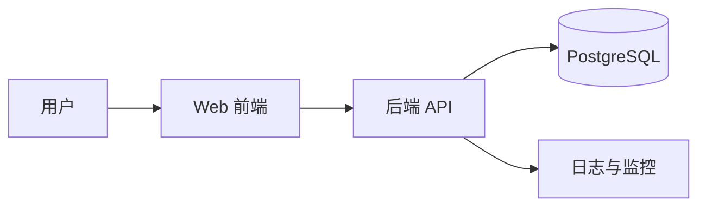

# 技术设计文档 HLD

## 背景与目标

TeamTodo V1 需要支持任务管理、状态流转和评论。系统优先保证简单、可维护、易部署。

## 总体架构

## 核心模块

| 模块 | 职责 | 依赖 | 备注 |
| --- | --- | --- | --- |
| Web 前端 | 页面展示与交互 | API | React/Next.js |
| 任务服务 | 任务 CRUD 与状态流转 | DB | 核心业务模块 |
| 评论服务 | 评论创建与查询 | DB | 依附任务 |
| 认证模块 | 登录态与团队隔离 | 用户表 | V1 使用基础权限 |

## 数据流

1. 用户在前端发起任务操作。
2. API 校验登录态和团队权限。
3. 服务写入数据库并返回最新数据。

## 接口边界

| 调用方 | 被调用方 | 协议/接口 | 说明 |
| --- | --- | --- | --- |
| Web 前端 | 后端 API | HTTPS/JSON | 任务与评论操作 |
| 后端 API | PostgreSQL | SQL | 数据读写 |

## 技术选型

| 领域 | 方案 | 原因 | 备选 |
| --- | --- | --- | --- |
| 前端 | Next.js | 开发快，路由和构建成熟 | Vite |
| 后端 | Node.js API | 团队熟悉，生态完整 | Python FastAPI |
| 数据库 | PostgreSQL | 关系清晰，事务可靠 | SQLite |

## 安全、性能与稳定性

- 安全：所有接口校验用户所属团队。
- 性能：任务列表分页查询，避免一次加载过多数据。
- 稳定性：关键接口记录日志，异常返回统一错误格式。

## 风险与取舍

- V1 不做复杂角色权限，降低实现成本，但需要保留后续扩展空间。

