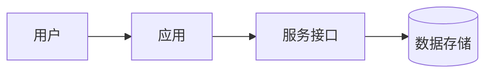

# 技术设计文档 HLD

## 背景与目标

## 总体架构

## 核心模块

| 模块 | 职责 | 依赖 | 备注 |
| --- | --- | --- | --- |
|  |  |  |  |

## 数据流

1. 
2. 
3. 

## 接口边界

| 调用方 | 被调用方 | 协议/接口 | 说明 |
| --- | --- | --- | --- |
|  |  |  |  |

## 技术选型

| 领域 | 方案 | 原因 | 备选 |
| --- | --- | --- | --- |
|  |  |  |  |

## 安全、性能与稳定性

- 安全：
- 性能：
- 稳定性：

## 风险与取舍

- 

