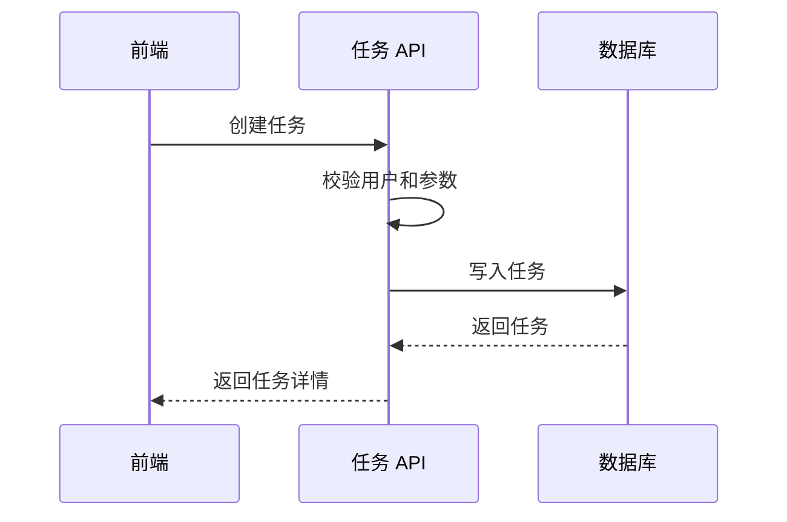

# 技术设计文档 LLD

## 关联 HLD

- `03_technical_design_hld.example.md`

## 模块范围

任务服务负责任务的创建、查询、更新、删除和状态流转。

## 数据模型

| 名称 | 字段 | 类型 | 说明 |
| --- | --- | --- | --- |
| tasks | id | uuid | 任务 ID |
| tasks | project_id | uuid | 所属项目 |
| tasks | title | text | 任务标题 |
| tasks | status | enum | todo / doing / done |
| tasks | assignee_id | uuid | 负责人 |
| comments | task_id | uuid | 所属任务 |
| comments | content | text | 评论内容 |

## 接口设计

### 创建任务

- 方法：POST
- 路径：`/api/tasks`
- 请求：`title`, `project_id`, `assignee_id`, `description`
- 响应：任务详情
- 错误码：`401` 未登录，`403` 无权限，`400` 参数错误

### 更新任务状态

- 方法：PATCH
- 路径：`/api/tasks/{id}/status`
- 请求：`status`
- 响应：更新后的任务详情
- 错误码：`404` 任务不存在，`403` 无权限

## 业务逻辑

## 边界情况

| 场景 | 处理方式 |
| --- | --- |
| 标题为空 | 返回参数错误 |
| 用户不属于项目 | 返回无权限 |
| 任务已删除 | 返回任务不存在 |

## 测试计划

| 类型 | 覆盖点 | 方式 |
| --- | --- | --- |
| 单元测试 | 参数校验、状态流转 | 服务层测试 |
| 集成测试 | 创建任务、更新状态 | API 测试 |
| 回归测试 | 列表与详情同步 | 端到端测试 |

## 待确认

- 是否允许已完成任务重新回到进行中。

