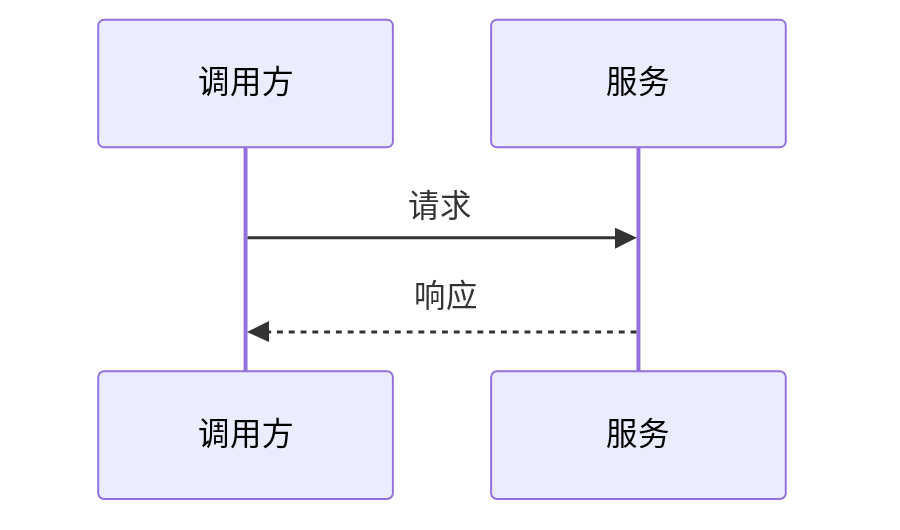

# 技术设计文档 LLD

## 关联 HLD

- 

## 模块范围

## 数据模型

| 名称 | 字段 | 类型 | 说明 |
| --- | --- | --- | --- |
|  |  |  |  |

## 接口设计

### 接口名称

- 方法：
- 路径：
- 请求：
- 响应：
- 错误码：

## 业务逻辑

## 边界情况

| 场景 | 处理方式 |
| --- | --- |
|  |  |

## 测试计划

| 类型 | 覆盖点 | 方式 |
| --- | --- | --- |
| 单元测试 |  |  |
| 集成测试 |  |  |
| 回归测试 |  |  |

## 待确认

- 

